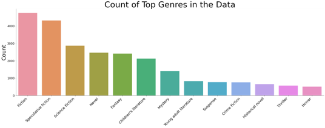

# Predicting a Book's Genre from its Summary using NLP

Genre is one of those well known but poorly defined concepts which haunt the creative world. The purpose of this project is to bring genre into the realm of scientific analysis by using NLP to predict a book's genre from its summary. This will benefit literary entities such as editors and publishers by facilitating some of their daily work. To this end, we trained a complement naive Bayes model on term frequency - inverse document frequency data for the summaries of 12,000+ books, targeting the genre of the text. Our model fails to perform as hoped, correctly predicting the genre of known texts only 1 in 5 times.

## Introduction
Art is all around us, and genre is an inseparable part of that art. As anyone who likes to read can tell you, the genre isn't the book but the book has to be the genre. For such an integral part of art, though, genre is surprisingly difficult to define. Speaking about how it informs his writing, Neil Gaiman proposes that the genre is a contract between artist and consumer--that the consumer expects certain things to be present based on the genre and that they will feel betrayed if those characteristics are absent[^1].

Regardless of our ability to define the concept, we use genre every day to discuss and describe books (and we might as well admit it: TV shows, movies, video games, songs, and most any other form of media, too). The New York Times offers lists of their best-sellers by genre. When you visit a library, the books will be ordered by genre. There are genre book awards and genre clubs. Genre is all around us.

But how much of genre can be understood just from the text? This project explores the interplay of genre and text as well as our ability to link the two.

## Modeling
Our data was taken from Jasminyas' __[CMU Book Summary Dataset](https://www.kaggle.com/datasets/ymaricar/cmu-book-summary-dataset)__ on Kaggle. It contains our key values of book summaries from Wikipedia and book genres from Freebase, as well as other attributes which provide context, such as the title, author, and date published.

The dataset contained 16,000+ books, but only 12,000 were tagged with genres. Of these, most books had multiple genres, and many of the genres were underrepresented (<20 samples in the entire set). To counter this imbalance, we dropped all genres with <500 samples, retaining only the most popular genres in our set (see below). These were the genres our model was trained to predict.

We first cleaned and transformed the summaries for Natural Language Processing (NLP) by...
  1. breaking them into sentences, 
  2. removing punctuation and digits, 
  3. making everything lower-case, 
  4. dropping stopwords, 
  5. tagging the parts of speech, 
  6. lemmatizing the remaining text, and finally 
  7. reassembling the processed text into a single string for each book.
After pre-processing, we created two versions of the data for analysis: one using Bag of Words approach (CountVectorizer) and another using Term Frequency - Inverse Document Frequency (TfidfVecotrizer). We then build and compared two models for each version of the data.

The first model set we trained used a complement naive Bayes methodology to predict the genres based on transformed summaries (both BoW and TF-IDF). Naive Bayes methods are commonly used for NLP tasks and have a history of good predictive power in tasks such as sentiment analysis. Multinomial naive Bayes is the most common chouce for this tast, though complement has been seen to outperform it in NLP tasks on a regular basis. Our results were the same for both preparations, and the scores were universally low (accuracy ~16%).

Our second model set was a multinomial naive Bayes. Since this is the classic choice, it was a reasonable baseline for comparison. However, its scores were similar to those of the complement naive Bayes, through there was an odd difference in the TF-IDF data where the training accuracy was lower and the test accuracy was higher (~20%) than our other versions.

Since the preparations performed similarly in both baseline models, we continued with the complement naive Bayes modeling using our TF-IDF data. We performed a comprehensive scan for the most appropriate alpha for our model and extended it with k-fold validation. However, like with the TF-IDF data in our multinomial model, futher training actually reduced the training score while improving the test score. Digging into this phenomenon, we discovered that our model had foud that the best way to improve its own accuracy was to predict either Fiction or Speculative Fiction for every text. While this was absolutely more accurate over the entire set, it was likely a result of our large genre imbalances and actually delivered less utility than our baseline cnb model.

## Concluding Remarks
Despite its underwhelming performance, the baseline complement naive Bayes model with TF-IDF data was ultimately the best. There are still many possible ways in which to improve the model, but it is of limited utility in its current form. There are several sgnificant limitations (like the poor accuracy, limited set of genres, and single-genre suggestions), though these might be targets for future improvements. The most promising avenue of improvement is the choice of a different modeling technique. While CNB and MNB are both commonly used for predictive NLP tasks, the presence of multiple genres per book might perform better with a multi-class classification model.

### Working Directory Structure

[^1]: From "The View from the Cheap Seats: Selected Nonfiction" by Neil Gaiman, 2016.
